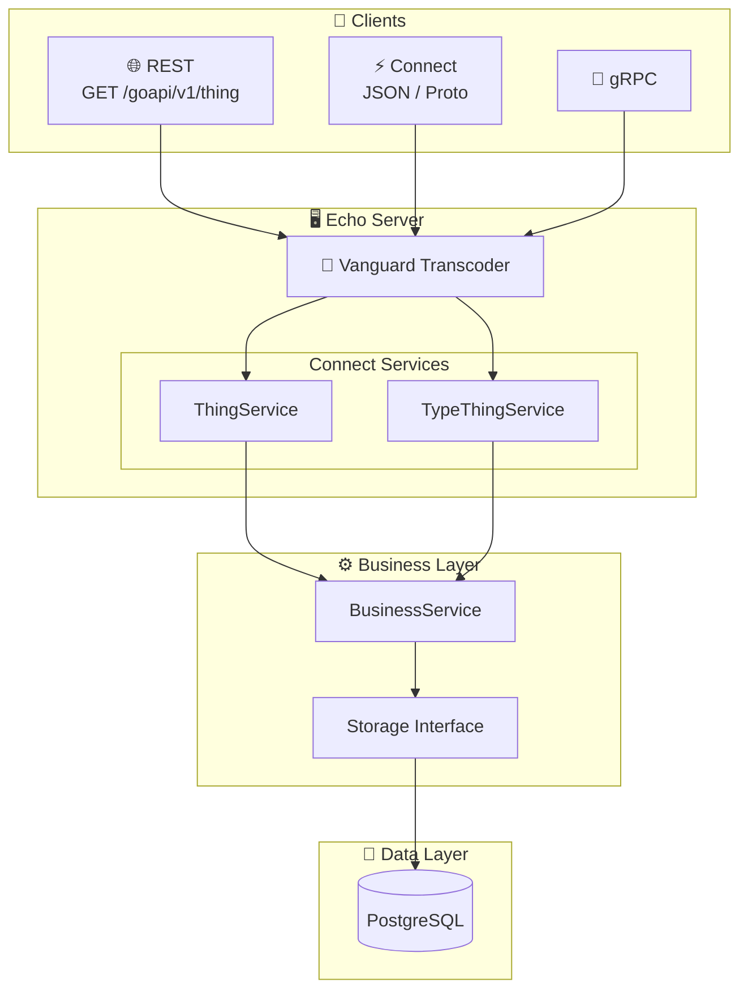
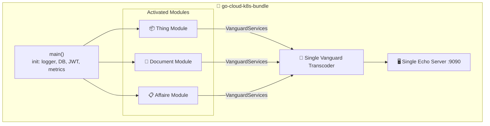

[](https://sonarcloud.io/summary/new_code?id=lao-tseu-is-alive_go-cloud-k8s-thing)
[](https://sonarcloud.io/summary/new_code?id=lao-tseu-is-alive_go-cloud-k8s-thing)
[](https://sonarcloud.io/summary/new_code?id=lao-tseu-is-alive_go-cloud-k8s-thing)
[](https://sonarcloud.io/summary/new_code?id=lao-tseu-is-alive_go-cloud-k8s-thing)
[](https://github.com/lao-tseu-is-alive/go-cloud-k8s-thing/actions/workflows/test.yml)
[](https://github.com/lao-tseu-is-alive/go-cloud-k8s-thing/actions/workflows/cve-trivy-scan.yml)
[](https://codecov.io/gh/lao-tseu-is-alive/go-cloud-k8s-thing)

# 🚀 go-cloud-k8s-thing

A modern **Proto-first** microservice for managing "Things" — built with Go, gRPC, ConnectRPC, and designed for cloud-native Kubernetes deployments. Includes an **importable module** for composing multiple microservices into a single bundle.

> **Proto as Source of Truth**: API contracts are defined in Protocol Buffers, generating both Go code and OpenAPI specs automatically. Clients can connect via REST, gRPC, or Connect protocols.

## ✨ Features

- 🔐 **JWT Authentication** — Secure endpoints with token-based auth from [go-cloud-k8s-user-group](https://github.com/lao-tseu-is-alive/go-cloud-k8s-user-group)
- 📡 **Multi-Protocol Support** — REST, gRPC, and Connect (JSON/Proto) via [Vanguard transcoding](https://github.com/connectrpc/vanguard-go)
- 📋 **Proto-First Design** — Single source of truth for API definitions
- 🐘 **PostgreSQL Backend** — Robust data persistence with pgx driver
- 🐳 **Container Ready** — Optimized Docker images with CVE scanning via Trivy
- ☸️ **Kubernetes Native** — Ready for K8s deployment with health checks and metrics

---

## 🏗️ Architecture



---

## 📦 Module & Bundle Strategy

Since **v0.3.0**, the Thing domain is packaged as an importable Go module in `pkg/thing/module/`. This enables two deployment modes:

### Standalone Mode (current)

The `cmd/goCloudK8sThingServer` main uses `thingmodule.New()` + `thingmodule.RegisterRoutes(e)` internally — one microservice, one binary, one port.

### Bundle Mode (multi-service)

A separate `go-cloud-k8s-bundle` repository can import multiple domain modules (Thing, Document, Affaire…) behind a **single Echo server** and a **single Vanguard transcoder**:



### Module API

Each module exposes:

| Method | Purpose |
|--------|---------|
| `New(ctx, cfg, deps)` | Create module (storage + business service) |
| `VanguardServices()` | Return `[]*vanguard.Service` for shared transcoder |
| `RoutePatterns()` | REST patterns (e.g. `/thing*`, `/types*`) |
| `ConnectPatterns()` | gRPC patterns (e.g. `/thing.v1.*`) |
| `RegisterRoutes(e)` | Standalone shortcut (creates its own transcoder) |
| `Migrate(dbDsn)` | Run embedded SQL migrations |
| `Start(ctx)` / `Stop(ctx)` | Future: background workers (JetStream, etc.) |

### Bundle: Database Isolation

Each module uses its own PostgreSQL **schema** (e.g. `go_thing`, `go_document`) and its own migration table. A single shared database is sufficient — no need for separate databases.

### Bundle: Local Development with `go.work`

Use `go.work` for local multi-module development (not committed to the bundle repo):

```bash
# In the parent directory of all repos
go work init
go work use ./go-cloud-k8s-thing
go work use ./go-cloud-k8s-document
go work use ./go-cloud-k8s-bundle
```

---

## 📦 Proto-First API Design

The API is defined using **Protocol Buffers** as the single source of truth:

```
api/proto/thing/v1/
├── thing.proto           # ThingService definitions
└── type_thing.proto      # TypeThingService definitions
```

### Generated Artifacts

| Source | Generated | Purpose |
|--------|-----------|---------|
| `.proto` files | `gen/thing/v1/*.go` | Go types & gRPC stubs |
| `.proto` files | `gen/thing/v1/thingv1connect/*.go` | Connect handlers |
| `.proto` files | `api/openapi/thing.yaml` | OpenAPI 3.0 spec |

### Regenerate Code

```bash
./scripts/buf_generate.sh
# or
buf generate api/proto
```

---

## 🔌 API Endpoints

All endpoints are prefixed with `/goapi/v1` and require JWT authentication.

### Thing Resources

| Method | Endpoint | Description |
|--------|----------|-------------|
| `GET` | `/goapi/v1/thing` | List things |
| `POST` | `/goapi/v1/thing` | Create a thing |
| `GET` | `/goapi/v1/thing/{id}` | Get thing by ID |
| `PUT` | `/goapi/v1/thing/{id}` | Update a thing |
| `DELETE` | `/goapi/v1/thing/{id}` | Delete a thing |
| `GET` | `/goapi/v1/thing/search` | Search things |
| `GET` | `/goapi/v1/thing/count` | Count things |
| `GET` | `/goapi/v1/thing/geojson` | Get GeoJSON |

### TypeThing Resources

| Method | Endpoint | Description |
|--------|----------|-------------|
| `GET` | `/goapi/v1/types` | List type things |
| `POST` | `/goapi/v1/types` | Create type thing |
| `GET` | `/goapi/v1/types/{id}` | Get type thing by ID |
| `PUT` | `/goapi/v1/types/{id}` | Update type thing |
| `DELETE` | `/goapi/v1/types/{id}` | Delete type thing |
| `GET` | `/goapi/v1/types/count` | Count type things |

### Connect RPC Endpoints

```bash
# Connect JSON format
curl -X POST http://localhost:9090/thing.v1.ThingService/List \
  -H "Content-Type: application/json" \
  -H "Authorization: Bearer $TOKEN" \
  -d '{"limit": 10}'
```

---

## 🚀 Quick Start

### Prerequisites

- Go 1.26+
- PostgreSQL 14+
- [buf](https://buf.build/docs/installation) (for proto generation)

### Environment Variables

```bash
# Required
export PORT=9090
export DB_HOST=localhost
export DB_PORT=5432
export DB_NAME=go_cloud_k8s_thing
export DB_USER=your_user
export DB_PASSWORD=your_password
export JWT_SECRET=your_jwt_secret
export ADMIN_PASSWORD=your_admin_password
```

### Run Locally

```bash
# Install dependencies
go mod download

# Run database migrations
# (migrations are auto-applied on startup)

# Start the server
go run ./cmd/goCloudK8sThingServer
```

### Run Tests

```bash
make test
```

---

## 🐳 Docker

### Pull from GitHub Container Registry

```bash
docker pull ghcr.io/lao-tseu-is-alive/go-cloud-k8s-thing:latest
```

### Build Locally

```bash
docker build -t go-cloud-k8s-thing .
```

Find all available versions in the [Packages section](https://github.com/lao-tseu-is-alive/go-cloud-k8s-thing/pkgs/container/go-cloud-k8s-thing).

---

## 📚 Documentation

- 📋 [Requirements](./documentation/Requirements.md) — Functional and system requirements
- 🔗 [OpenAPI Spec (YAML)](./api/openapi/thing.yaml) — Generated from proto
- 🌐 [Swagger UI](https://lao-tseu-is-alive.github.io/go-cloud-k8s-thing/) — Interactive API docs

---

## 🛠️ Tech Stack

| Category | Technology                                                                                    |
|----------|-----------------------------------------------------------------------------------------------|
| **Language** | Go 1.26+                                                                                      |
| **API Framework** | [Echo](https://echo.labstack.com/)                                                            |
| **RPC** | [ConnectRPC](https://connectrpc.com/) + [Vanguard](https://github.com/connectrpc/vanguard-go) |
| **Proto Tooling** | [buf](https://buf.build/)                                                                     |
| **Database** | PostgreSQL with [pgx](https://github.com/jackc/pgx)                                           |
| **Auth** | JWT via [cristalhq/jwt](https://github.com/cristalhq/jwt)                                     |
| **Monitoring** | Prometheus metrics                                                                            |
| **Container** | Docker with multi-stage builds                                                                |
| **Security** | [Trivy](https://aquasecurity.github.io/trivy/) CVE scanning                                   |

---

## 📁 Project Structure

```
go-cloud-k8s-thing/
├── api/
│   ├── proto/thing/v1/            # 📋 Proto definitions (source of truth)
│   └── openapi/                    # 📄 Generated OpenAPI specs
├── cmd/
│   └── goCloudK8sThingServer/     # 🚀 Main application entry point
├── gen/
│   └── thing/v1/                  # ⚙️ Generated Go code from protos
├── pkg/
│   ├── thing/                     # 📦 Business logic
│   │   ├── business_service.go    # Core business operations
│   │   ├── connect_server.go      # Connect RPC handlers
│   │   ├── auth_interceptor.go    # JWT auth interceptor
│   │   ├── mappers.go             # Domain ↔ Proto conversion
│   │   ├── storage.go             # Storage interface
│   │   └── storage_postgres.go    # Database operations
│   └── thing/module/              # 🎁 Importable module for bundle
│       ├── module.go              # Module, Config, Deps, New()
│       ├── routes.go              # VanguardServices, RegisterRoutes
│       ├── migrate.go             # Embedded SQL migrations
│       └── db/migrations/*.sql    # SQL migration files
├── scripts/                       # 🔧 Build & generation scripts
└── documentation/                 # 📚 Requirements & docs
```

---

## 🔒 Security

- All CVE scans performed automatically before container builds
- JWT authentication required for all `/goapi/v1/*` endpoints
- SonarCloud analysis for code quality and security
- Dependabot for dependency updates

---

## 📄 License

MIT License — See [LICENSE](./LICENSE) for details.

---

<p align="center">
  Built with ❤️ using Go, Proto, and Connect
</p>
